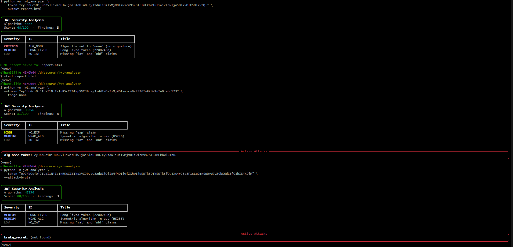
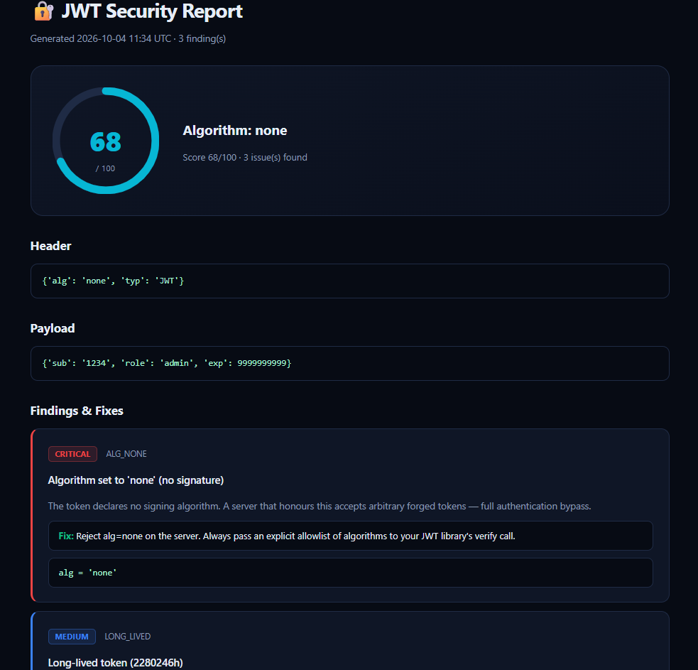

# 🔐 SecurAI JWT Analyzer

A Python CLI tool that decodes a JWT and checks it for the most common real-world vulnerabilities - `alg=none`, weak HMAC secrets, RS256→HS256 confusion, missing expiration, and sensitive data in the payload.

**WARNING: For educational and authorized testing only. Only use against systems you own or have explicit written permission to test.**

## Demo

### CLI output

### HTML report

## Detected vulnerabilities

| Vulnerability | Severity | What it means |
|---|---|---|
| `alg=none` | Critical | Token declares no signature; server may accept arbitrary forgeries |
| Weak HMAC secret | Critical | Secret recovered via wordlist; anyone can forge tokens |
| RS256→HS256 confusion | Critical | Verifier's public key used as HMAC secret |
| Expired token | High | `exp` in the past |
| Missing `exp` | High | Token valid forever |
| Risky `kid`/`jku`/`x5u` header | High | Key-injection vectors |
| Long-lived token | Medium | Validity > 7 days |
| Weak algorithm | Medium | HS256 in a multi-verifier architecture |
| Sensitive data in payload | Medium | Passwords/PII in the (only base64-encoded) payload |
| Missing `iat`/`nbf` | Low | Token lifetime hard to reason about |

## Installation

    git clone https://github.com/ElhamBidarigh/jwt-analyzer.git
    cd jwt-analyzer
    py -m venv venv
    source venv/Scripts/activate
    pip install -r requirements.txt

## Usage

Analyze a token:

    python -m jwt_analyzer --token eyJhbGciOiJub25lIn0...

Verbose explanations:

    python -m jwt_analyzer --token <token> --verbose

Save an HTML report:

    python -m jwt_analyzer --token <token> --output report.html

Machine-readable JSON (for CI):

    python -m jwt_analyzer --token <token> --json

Brute-force the HMAC secret:

    python -m jwt_analyzer --token <token> --attack-brute

Forge an alg=none variant:

    python -m jwt_analyzer --token <token> --forge-none

RS256→HS256 confusion (supply the public key):

    python -m jwt_analyzer --token <token> --attack-confusion --public-key public.pem

## Exit codes

- `0` - no critical/high findings
- `1` - at least one critical or high finding (useful to gate a CI pipeline)
- `2` - invalid input (bad JWT format, missing file, etc.)

## Tests

    python -m pytest tests/ -v

All 11 tests should pass.

## The full SecurAI toolkit

| Tool | Type | Link |
|------|------|------|
| 🛡️ Audit Tool | Self-assessment (browser) | [Live demo](https://elhambidarigh.github.io/securai/) |
| 🔬 Vuln Lab | Educational (PHP/MySQL) | [Repo](https://github.com/ElhamBidarigh/securAI-vuln-lab) |
| 🔐 JWT Analyzer | CLI (Python) | You are here |
| 🔍 Active Scanner | Live URL scanner (PHP) | [Repo](https://github.com/ElhamBidarigh/securAI-active-scanner) |

## License

MIT - for educational and authorized testing use only.
